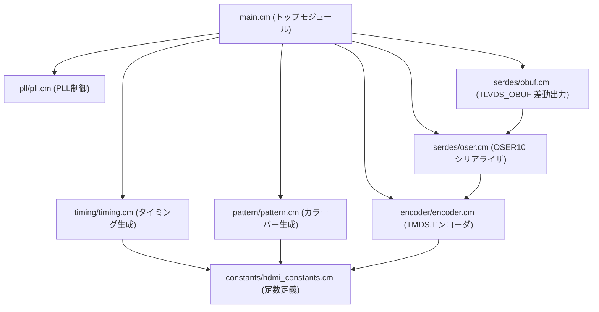

# HDMI出力モジュール 実装サマリー

本ドキュメントでは、Cm言語で実装されたHDMI（DVIモード）出力モジュール全体のソフトウェアアーキテクチャおよび各モジュールの役割について説明します。

本プロジェクトは、Cmコンパイラを用いてSystemVerilog（SV）ソースコードへとトランスパイルされ、Gowin EDAを通じて実機（Sipeed Tang Console 138Kなど）向けのビットストリームとして合成されます。

---

## 1. 全体アーキテクチャ概要

HDMIモジュールは、以下の構成で640×480 @ 60Hz (VGA解像度) のカラーバー映像をHDMI出力します。

- **映像規格**: DVI 1.0 準拠 (RGB 24-bit カラー、音声なし)
- **ピクセルクロック**: 25.2 MHz
- **シリアル転送クロック (DDR)**: 126.0 MHz (ピクセルクロックの5倍。OSER10による10:1 DDRシリアライズ用)
- **エンコーディング**: 8b/10b TMDS (Transition Minimized Differential Signaling) エンコーダ

### モジュール関連図

---

## 2. ディレクトリ構造と各モジュールの詳細

[src/hdmi/](../src/hdmi) 配下の構造と役割は以下の通りです。

### ① [main.cm](../src/hdmi/main.cm) (トップレベルモジュール)
- 外部入力クロック（`clk_50m`）、HDMI出力差動ピン（`tmds_d[0-2]_p/n`, `tmds_clk_p/n`）、およびデバッグLEDを宣言します。
- PLL、シリアライザ、差動バッファといったGowinハードウェアプリミティブのインスタンス化を行い、サブモジュール間で共有する内部信号（`pixel_clk`, `serial_clk`, `pll_lock`）をバインドします。

### ② [constants/hdmi_constants.cm](../src/hdmi/constants/hdmi_constants.cm) (定数ライブラリ)
- VGA規格（640x480 @ 60Hz）に必要なタイミング定数を定義します。
  - 水平方向: アクティブ期間 640、Front Porch 16、Sync Pulse 96、Back Porch 48、合計 800 ピクセル
  - 垂直方向: アクティブ期間 480、Front Porch 10、Sync Pulse 2、Back Porch 33、合計 525 ライン
- DVI 1.0で規定されるTMDSコントロールトークン（HSYNC/VSYNCの状態に対応する10-bitコード）を定義します。

### ③ [pll/pll.cm](../src/hdmi/pll/pll.cm) (PLLクロック生成)
- Gowinの `PLL` プリミティブ（rPLL/rPLL_FRACなど）をラップしています。
- 外部の50MHz入力クロックから、以下の2つのクロックを生成します。
  - `CLKOUT0` (`pixel_clk`): 25.2 MHz (ピクセル同期クロック)
  - `CLKOUT1` (`serial_clk`): 126.0 MHz (シリアルシリアライズ用高速クロック)

### ④ [timing/timing.cm](../src/hdmi/timing/timing.cm) (ビデオタイミング生成)
- `pixel_clk` の立ち上がりエッジに同期して動作する `video_timing` 非同期スレッド（SystemVerilogの `always` ブロック相当）を定義します。
- 水平カウンタ（`hc`）、垂直カウンタ（`vc`）を進め、同期信号 `hsync_reg`（水平同期）、`vsync_reg`（垂直同期）、および映像有効表示期間を示す `de_reg` (Data Enable) を生成します。

### ⑤ [pattern/pattern.cm](../src/hdmi/pattern/pattern.cm) (カラーバー生成)
- タイミング情報（`hc`, `de_reg`）に基づき、8色の縦型カラーバーのRGBデータ（R, G, B各8-bit）を生成します。
- 画面を横方向に8等分（幅80ピクセル）し、左から「白、黄、シアン、緑、マゼンタ、赤、青、黒」を出力します。映像無効期間（`de_reg == false`）は黒（値0）を出力します。

### ⑥ [encoder/encoder.cm](../src/hdmi/encoder/encoder.cm) (TMDSエンコーダ)
- RGBの各8-bitデータをDVI仕様に基づいて10-bitのTMDSデータに変換します。
- **遷移最小化 (Transition Minimization)**: 映像信号の遷移を抑えて電磁妨害（EMI）を低減します。
- **DCバランス (DC Balancing)**: 送信データの1と0の割合を平準化し、AC結合時の直流バイアスズレを防ぎます。
- ディスパリティ（累積不均衡カウンタ）を毎サイクル算出し、動的にビットを反転します。

### ⑦ [serdes/oser.cm](../src/hdmi/serdes/oser.cm) (10:1 DDR シリアライザ)
- Gowinの高速シリアライザプリミティブ `OSER10` を定義します。
- `pixel_clk` (25.2MHz) と `serial_clk` (126MHz) の2つのクロックを入力し、10-bitのパラレルTMDSデータをDDR（Double Data Rate）方式でシリアル出力します。
- クロックチャネル用OSER10（`oser_ck`）には、固定データ `10'b0000011111` (D0-D4=1, D5-D9=0) を供給することで、差動ピクセルクロックを自動的に再生・出力します。

### ⑧ [serdes/obuf.cm](../src/hdmi/serdes/obuf.cm) (差動バッファ出力)
- Gowinの差動出力プリミティブ `TLVDS_OBUF` を定義します。
- 各チャネル（Red, Green, Blue, Clock）のシリアル信号を、HDMI物理レイヤーで要求されるLVDS / CML差動信号へと変換して出力します。

---

## 3. クロック・タイミング設計

HDMI（DVIモード）出力は、ピクセル同期とシリアライズ動作のために厳密なクロック比（1:5 DDR）を保つ必要があります。

| クロック名 | 周波数 | 用途 | 算出方法・生成方法 |
|------------|--------|------|--------------------|
| `clk_50m` | 50.0 MHz | システム入力 | 外部水晶発振器から直接入力 |
| `pixel_clk` | 25.2 MHz | ピクセル処理 | 50MHz × 30.2 (FBDIV/MDIV) ÷ 30 (ODIV0) ≒ 25.2 MHz |
| `serial_clk` | 126.0 MHz | 高速シリアル転送 | 50MHz × 30.2 (FBDIV/MDIV) ÷ 6 (ODIV1) ≒ 126.0 MHz |

Gowin PLL（`PLL`）設定値:
- `IDIV_SEL = 2` (入力分周 3)
- `MDIV_SEL = 30`, `MDIV_FRAC_SEL = 2` (フィードバック乗算)
- `ODIV0_SEL = 30` (25.2MHz 出力用分周)
- `ODIV1_SEL = 6` (126.0MHz 出力用分周)
- クロック倍率: `serial_clk` / `pixel_clk` = 5.0 (DDRにより1クロックで2bit出力するため、実質10倍速シリアライズを実現)
